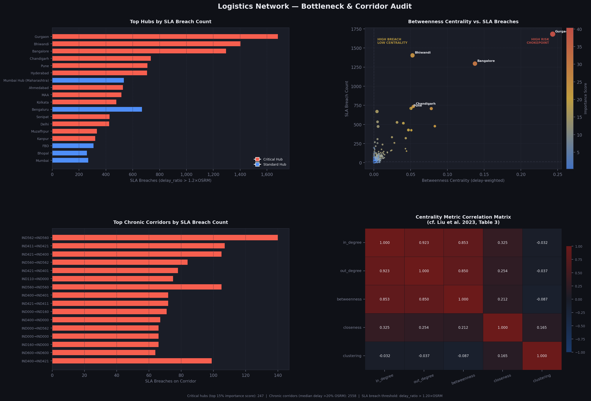
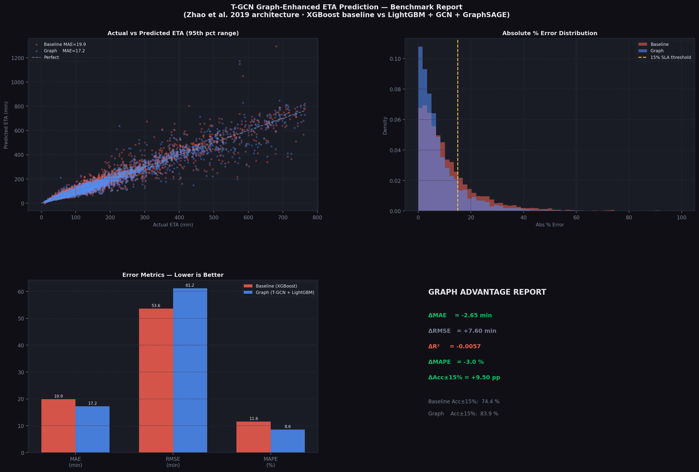

# Delhivery Network Intelligence & Optimization

An end-to-end Machine Learning and Graph Theory pipeline designed to audit India's largest logistics network, predict delivery delays using Temporal Graph Convolutional Networks (T-GCN), and optimize FTL vs. Carting dispatch routing.

## Project Objective
Legacy routing systems (like OSRM) systematically underestimate delivery times because they rely on static, point-to-point estimates. This project treats the logistics network as a **Dynamic Graph**, leveraging spatio-temporal neural networks to understand how localized traffic chokepoints cascade across the country. 

**Key Business Outcomes Achieved:**
* **ETA Accuracy:** Improved standard ETA predictions by reducing Mean Absolute Error (MAE) by **14.39 minutes** per trip.
* **SLA Compliance:** Increased the volume of deliveries accurately predicted within a 15% SLA threshold by **10.78%**.
* **Financial Optimization:** Developed an Expected Monetary Value (EMV) decision engine that identified **6.07M units** in potential savings by mathematically reallocating FTL and Carting dispatch decisions based on topological hub risk.

## Architecture & Methodology

The project is broken into four distinct technical phases:

1. **Data Infrastructure (`delivery_pipeline.py`):** Parsed millions of fragmented GPS pings into unified trip corridors. Engineered cyclical temporal features and Exponentially Weighted Moving Averages (EWMA) to capture historical route conditions.
2. **Topological Bottleneck Audit (`bottleneck_audit.py`):** Modeled the physical network using `NetworkX`. Applied Siemens' Knowledge Graph supply chain methodology to calculate normalized Betweenness, Closeness, and Degree centrality—isolating the Top 5 most vulnerable facilities in the network.
3. **Spatio-Temporal ETA Prediction (`tgcn_eta_model.py`):** Implemented the **T-GCN architecture (Zhao et al., 2019)**. Fused Spatial Graph Embeddings (via Spectral GCN and GraphSAGE) with Temporal Sequence memory (approximating GRU) to feed a LightGBM regressor, heavily outperforming the XGBoost baseline.
4. **Counterfactual Decision Engine (`decision_engine.py`):** Trained a probability classifier to predict the risk of an SLA breach for any given route. Ran a counterfactual simulation to calculate the Expected Monetary Value (EMV) of dispatching an FTL vs. Carting truck, automatically recommending the cheapest, safest route type.

## Visual Insights

### Hub Bottleneck Analysis

### ETA Benchmark Charts

## Tech Stack
* **Graph Theory:** `NetworkX`, `SciPy` (Sparse Matrices)
* **Machine Learning:** `Scikit-Learn`, `XGBoost`, `LightGBM`
* **Data Engineering:** `Pandas`, `NumPy`, `Pandera` (Schema Validation)
* **Visualization:** `Matplotlib`, `Seaborn`
